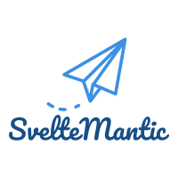

    

## What is SvelteMantic
**Work in progress - PRs are welcome!**
**Logo redesign PR are welcome as well**

The philosophy of this library is to provide all Fomantic-UI (fork of Semantic-UI as it's not under active development) components for a Svelte/Sapper app, without needing to use Fomantic-UI component classes or needing to include Fomantic-UI's JavaScript.

However, to make using Fomantic-UI themes easier, this library does not embed Fomantic-UI styles directly and you will need to include Fomantic-UI CSS in your web app.

## Progress List
### Elements
-   [x] Buttons
-   [x] Container
-   [x] Divider (No Header support)
-   [x] Flag
-   [x] Group (Supports grouping for Label, Button, Icon, Segment | **No Step support yet**)
-   [x] Header
-   [x] Icon
-   [x] Image
-   [x] Input
-   [ ] Label
-   [ ] List
-   [x] Loader
-   [x] Placeholder
-   [x] Rail
-   [x] Reveal
-   [x] Segment
-   [x] Step
-   [x] Text

### Behaviors
-   [ ] Todo

### Collections
-   [ ] TODO

### Modules
-   [ ] TODO

### Views
-   [ ] TODO

## Tests
-   [ ] TODO

## Other UI Frameworks
Svelte UI libraries are really starting to make good progress. Check these other framework bindings
-   [Svelte 3 Material UI](https://github.com/hperrin/svelte-material-ui)

## License

